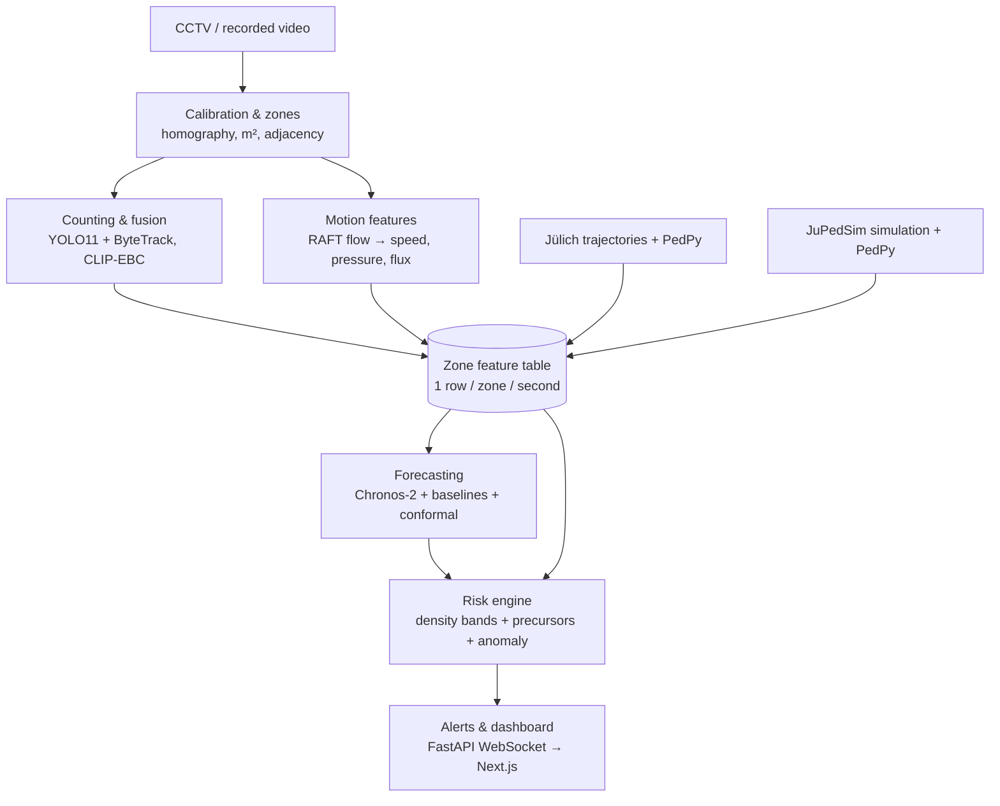

# architecture.md — CrowdSafe system architecture

## 1. Overview

The system has two layers joined by one table.

- **Vision layer:** video → per-zone measurements (count, density, motion). Runs on real cameras.
- **Prediction layer:** per-zone feature sequences → forecasts → risk levels → alerts. Reads only the feature table.

Because the prediction layer never sees video, it can be developed and tested on Jülich trajectories and JuPedSim simulations (which have ground truth and reach dangerous densities), then run unchanged on real CCTV.



## 2. Components

### 2.1 Calibration and zones (`calibration/`, `configs/`)

- Homography H (3×3) from 4+ image points with known floor coordinates in metres (`cv2.findHomography` / `getPerspectiveTransform`).
- Zones: polygons in image pixels (drawn with the Roboflow PolygonZone tool), each with its real area in m² computed by projecting corners through H (Shapely).
- Adjacency list: which zones connect (graph for forecasting and spill-over rules).
- Boundaries: a line segment per adjacent pair, for inflow/outflow.
- Heads are assigned to zones in **image space**; H is used only for areas and speeds.

### 2.2 Counting and fusion (`counting/`)

- `yolo_track.py`: YOLO11l (or CrowdHuman person+head model) + ByteTrack; optional `InferenceSlicer` tiling for small heads.
- `density_model.py`: CLIP-EBC ViT-B/16 released weights; sliding-window inference; returns a density map.
- `fusion.py`: per-zone confidence-weighted fusion.

Fused zone count:

```
N_z = w_z · N_yolo_z + (1 − w_z) · N_density_z
w_z = sigmoid(θ · f_z)
```

where `f_z` = [mean detection confidence, detection count, share of boxes overlapping another with IoU > 0.3, mean box height in px, density-model count]. θ is fitted on validation frames (logistic regression or a 2-layer MLP). Counts are smoothed with an EMA over about 3 s. Density = N_z / area_z.

This fusion is the paper's main contribution; the ablation compares YOLO only, CLIP-EBC only, hard switch (old CrowdSafe) and weighted fusion.

### 2.3 Motion (`motion/`)

- `flow.py`: RAFT (`raft_large`, pretrained) at 3–5 FPS on frames resized to ~960 px wide. Farneback fallback.
- `zone_motion.py`: project each flow vector's start and end through H → velocity in m/s; mask to pixels where the density map shows people; aggregate per zone per second.

Per-zone motion features:

| Feature | Definition |
| --- | --- |
| `mean_speed` | density-weighted mean of speed (m/s) |
| `speed_var` | density-weighted variance of velocity |
| `pressure` | density × speed_var |
| `dir_entropy` | entropy of an 8-bin direction histogram |
| `counterflow` | share of flow opposite the zone's dominant direction |
| `inflow`, `outflow` | density × normal velocity summed along each boundary line (persons/s) |

Check: in sparse zones, compare `mean_speed` with ByteTrack track speeds (should agree within ~20%).

### 2.4 Feature table (`features/`)

One row per zone per second. Same schema for real, Jülich and simulated data.

```
timestamp: float        # seconds
camera_id: str          # or experiment / scenario id
zone_id: str
count: float
density: float          # persons/m²
fusion_weight: float    # NaN for trajectory-derived data
mean_speed: float       # m/s
speed_var: float
pressure: float
dir_entropy: float
counterflow: float
inflow: float           # persons/s
outflow: float          # persons/s
source: str             # real | julich | sim
```

Storage: Parquet per clip/experiment for experiments; SQLite for the live demo.

For Jülich and JuPedSim data, features come from trajectories through PedPy (density, speed, flow) plus small helpers for variance, entropy and counter-flow.

### 2.5 Forecasting (`forecasting/`)

- Input: last 60–120 s of the feature table for all zones of one camera/scenario.
- Output: density (and pressure) per zone at horizons 30 s, 60 s, 120 s (real clips) and additionally 300 s, 600 s (Jülich/sim), each as 10th/50th/90th percentiles.
- Models:
  1. `baselines.py` → persistence; physics fill-rate: `ρ(t+h) = ρ(t) + (inflow − outflow) / area × h`; also returns time-to-critical (seconds to 5 persons/m²).
  2. `chronos.py` → Chronos-2 zero-shot. Targets: each zone's density; group: all zones of a camera; covariates: pressure, inflow, outflow, mean_speed.
  3. `gru.py` → optional per-zone GRU (2 layers, hidden 64, pinball loss).
- `conformal.py` → split conformal on validation: widen the 90th-percentile bound until empirical exceedance ≤ 10%.

### 2.6 Risk engine and alerts (`risk/`)

Base level from the conformal-calibrated upper bound of forecast density:

| Density (persons/m²) | Level |
| --- | --- |
| < 2 | Low |
| 2–4 | Medium |
| 4–5 | High |
| > 5 | Critical |

Escalate one level if any precursor fires:

- `pressure` above threshold,
- flow collapse: `mean_speed` falling while density rises for ≥ 30 s,
- `counterflow` or `dir_entropy` above threshold,
- anomaly: Isolation Forest score spike together with a jump in speed and entropy (sudden running/scattering).

Thresholds are fitted on Jülich + simulation data and stored per venue in the camera YAML.

Alert logic: hysteresis (raise after N = 10 s, clear after M = 30 s). Every alert carries zone, level, time-to-critical and a human-readable reason.

### 2.7 Backend and dashboard (`server/`, `dashboard/`)

Runtime processes per camera, joined by queues:

| Process | Rate | Work |
| --- | --- | --- |
| Decoder | camera FPS | read stream, drop frames to the rates below |
| Counting | 2–5 FPS | YOLO + ByteTrack, CLIP-EBC, fusion |
| Motion | 3–5 FPS | RAFT, zone motion features |
| Features + forecast + risk | 1 Hz | merge, Chronos-2, rules, alerts |

FastAPI WebSocket message (1 Hz):

```json
{
  "timestamp": 1727712000.0,
  "camera_id": "cam01",
  "zones": [
    {
      "zone_id": "Z1",
      "density": 3.4,
      "mean_speed": 0.6,
      "pressure": 0.02,
      "forecast": {"h": [30, 60, 120], "p10": [3.3, 3.2, 3.1], "p50": [3.6, 3.9, 4.2], "p90": [3.9, 4.4, 5.1]},
      "level": "High",
      "time_to_critical_s": 140
    }
  ],
  "alerts": [
    {"zone_id": "Z1", "level": "High", "time_to_critical_s": 140, "reason": "inflow > outflow, pressure rising", "since": 1727711980.0}
  ]
}
```

Dashboard views: zone heatmap on the camera frame, per-zone forecast chart with 90% band and a 5 persons/m² line, alert feed, replay mode (recorded clip, Jülich experiment or simulation run).

## 3. Camera config schema

```yaml
camera_id: cam01
video: data/cctv/cam01.mp4
fps: 25
homography: [[...], [...], [...]]
calibration_note: "measured tiles 0.60 m"     # or "approximate: door width"
zones:
  - id: Z1
    polygon_px: [[120, 400], [620, 390], [700, 710], [60, 715]]
    area_m2: 24.5
adjacency: [[Z1, Z2], [Z2, Z3]]
boundaries:
  - between: [Z1, Z2]
    line_px: [[620, 390], [700, 710]]
thresholds:            # filled after tuning (T7)
  pressure: null
  dir_entropy: null
  counterflow: null
alerts:
  raise_after_s: 10
  clear_after_s: 30
```

## 4. Module interfaces

Keep these signatures so parts can be swapped and tested independently.

```python
class Detector:            # counting/yolo_track.py
    def __call__(self, frame) -> "sv.Detections": ...   # boxes, conf, tracker_id

class DensityModel:        # counting/density_model.py
    def __call__(self, frame) -> "np.ndarray": ...      # density map, same aspect as frame

class Fusion:              # counting/fusion.py
    def fit(self, features, targets) -> None: ...
    def __call__(self, zone_inputs) -> dict[str, float]: ...   # zone_id -> fused count

class FlowModel:           # motion/flow.py
    def __call__(self, frame_a, frame_b) -> "np.ndarray": ...  # HxWx2 pixel flow

class Forecaster:          # forecasting/*.py
    def predict(self, history: "pd.DataFrame", horizons: list[int]) -> "pd.DataFrame": ...
    # returns columns: zone_id, horizon_s, p10, p50, p90

class RiskEngine:          # risk/rules.py
    def __call__(self, features_now, forecast) -> list["ZoneRisk"]: ...
```

## 5. Data sources

| Source | Used for | Ground truth |
| --- | --- | --- |
| ShanghaiTech A/B, JHU-Crowd++, NWPU-Crowd | benchmarking counting weights | head points |
| Jülich Pedestrian Dynamics Data Archive | features, forecasting, vision validation | full trajectories |
| Mall, UCSD, FDST | real video sequences | counts |
| User's CCTV + recordings | real-world test | ~100 corrected frames |
| JuPedSim | rare critical scenarios | full trajectories |

## 6. Evaluation

| Question | Metric |
| --- | --- |
| Counting | MAE, RMSE per density band; ablation of 4 variants |
| Motion | speed error vs Jülich trajectories |
| Forecasting | MAE per horizon; empirical coverage of 90% bound; Chronos-2 vs persistence vs physics (vs GRU) |
| Alerts | mean lead time before 5 persons/m²; precision, recall; false alarms per hour |
| Runtime | end-to-end latency, FPS per camera, GPU memory |
| Generalisation | all of the above on held-out cameras, experiments and geometries |
